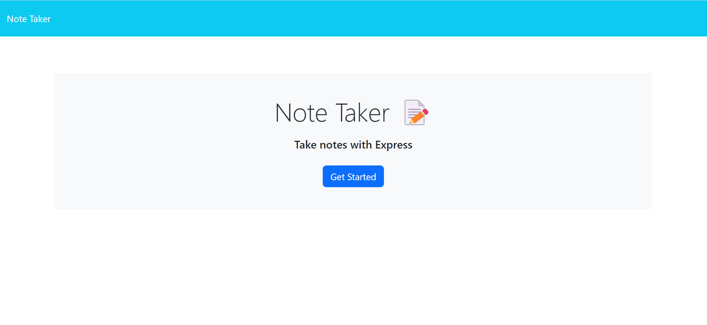

# Module 11 Challenge - Note Taker

## Description of Work
Created a note taking app using npm, inquirer, fs, and jest.

## Final Screenshot

## Links
[GitHub](https://github.com/bpavlis/note-taker)

[GitHub Pages](https://bpavlis.github.io/note-taker/)

[Heroku](https://note-taker-bpavlis-3be6e2f9308b.herokuapp.com/)